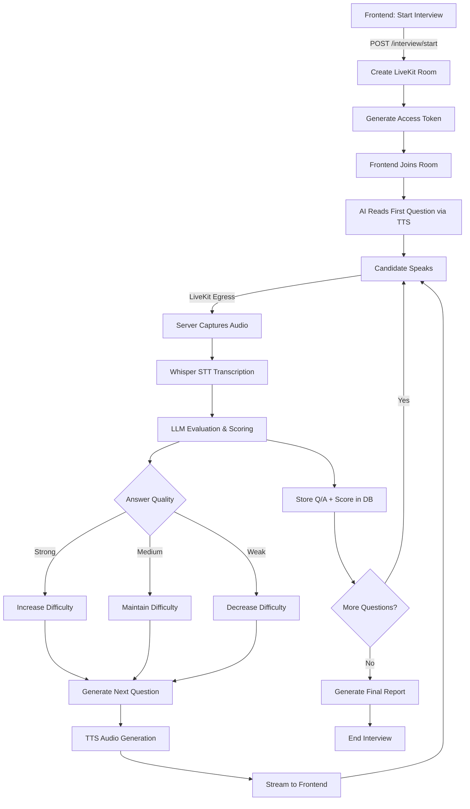

# Phase 2 — Live AI Intervi

ew Implementation Plan

## Overview

Build a complete real-time voice interview system that uses candidate CV data, manages interviews via AI with voice/video, converts candidate speech to text, evaluates answers in real-time, and adapts question difficulty dynamically.

## Architecture Flow

## Implementation Components

### 1. Database Schema Enhancements

**File:** `src/modules/interview/interview-session.model.js`Add new fields to store:

- Q/A pairs with scores and timestamps
- Current difficulty level tracking
- Evaluation results per answer
- Final report structure

**New Schema Fields:**

- `questions`: Array of question objects with difficulty, text, timestamp
- `answers`: Array of answer objects with transcript, score, evaluation, timestamp
- `currentDifficulty`: Current difficulty level (beginner/intermediate/advanced)
- `evaluationResults`: Array of evaluation objects with scores and feedback
- `finalReport`: Object containing overall score, strengths, weaknesses, recommendations

### 2. Answer Evaluation Service

**New File:** `src/modules/interview/evaluation.service.js`**Functions:**

- `evaluateAnswer(question, answer, candidateData)`: Evaluate answer quality using LLM
- `calculateScore(evaluation)`: Calculate numerical score (0-100)
- `determineDifficultyAdjustment(score, currentDifficulty)`: Determine next difficulty level
- `generateFeedback(evaluation)`: Generate detailed feedback for candidate

**Evaluation Criteria:**

- Technical accuracy (0-40 points)
- Completeness (0-30 points)
- Communication clarity (0-20 points)
- Relevance to question (0-10 points)

### 3. Adaptive Interview Manager

**New File:** `src/modules/interview/adaptive-interview.service.js`**Logic:**

- Strong answer (80-100): Increase difficulty or move to system design
- Medium answer (50-79): Maintain current difficulty
- Weak answer (0-49): Decrease difficulty or ask follow-up
- Incomplete answer: Ask clarifying follow-up question

**Functions:**

- `adjustDifficulty(currentDifficulty, score)`: Adjust difficulty based on score
- `selectNextQuestion(sessionId, difficulty, previousQuestions)`: Select appropriate next question
- `shouldAskFollowUp(answer, score)`: Determine if follow-up is needed

### 4. LiveKit Egress Integration

**New File:** `src/modules/interview/livekit-egress.service.js`**Functions:**

- `startEgress(roomName, sessionId)`: Start capturing audio from LiveKit room
- `processAudioChunk(audioBuffer, sessionId)`: Process incoming audio chunks
- `stopEgress(roomName)`: Stop audio capture

**Integration:**

- Use LiveKit Egress API to capture participant audio
- Buffer audio chunks for Whisper transcription
- Handle real-time audio streaming

### 5. Real-Time Audio Processing

**Enhance:** `src/modules/interview/livekit-interview.service.js`**New Functions:**

- `processRealtimeAudio(audioChunk, sessionId)`: Process audio chunk in real-time
- `transcribeAndEvaluate(audioBuffer, sessionId, questionId)`: Complete transcription and evaluation pipeline
- `generateAdaptiveResponse(sessionId, evaluation)`: Generate next question based on evaluation

### 6. WebSocket Handlers for Real-Time Updates

**Enhance:** `src/modules/interview/interview.socket.js`**New Events:**

- `audio-chunk`: Receive audio chunks from frontend (fallback if Egress unavailable)
- `transcription-update`: Send transcription updates in real-time
- `evaluation-result`: Send evaluation results immediately
- `difficulty-change`: Notify frontend of difficulty adjustment
- `question-ready`: Notify when next question is ready

### 7. API Endpoints

**Enhance:** `src/modules/interview/livekit.routes.js`**New/Enhanced Endpoints:**

- `POST /api/v1/interview/start`: Enhanced to initialize adaptive interview
- `POST /api/v1/interview/next`: Get next question based on evaluation
- `POST /api/v1/interview/evaluate`: Evaluate answer and get next question
- `POST /api/v1/interview/end`: Enhanced to generate final report
- `GET /api/v1/interview/session/:sessionId/report`: Get interview report

### 8. Final Report Generation

**Enhance:** `src/modules/interview/interview.service.js`**New Function:**

- `generateFinalReport(sessionId)`: Generate comprehensive interview report

**Report Includes:**

- Overall score and breakdown by category
- All Q/A pairs with individual scores
- Difficulty progression throughout interview
- Strengths and weaknesses identified
- Recommendations for improvement
- Technical skill assessment

## Data Flow

1. **Interview Start:**

- Create LiveKit room
- Initialize interview session with candidate CV data
- Set initial difficulty based on experience level
- Generate first question

2. **Question Delivery:**

- Convert question text to speech (TTS)
- Stream audio to frontend via LiveKit
- Store question in database

3. **Answer Processing:**

- Capture audio via LiveKit Egress
- Transcribe using Whisper STT
- Evaluate answer using LLM
- Calculate score and determine difficulty adjustment
- Store Q/A pair with evaluation

4. **Adaptive Response:**

- Adjust difficulty based on evaluation
- Generate next question or follow-up
- Convert to speech and stream

5. **Interview Completion:**

- Generate final comprehensive report
- Store all results in database
- Clean up LiveKit resources

## Key Files to Modify/Create

### New Files:

- `src/modules/interview/evaluation.service.js` - Answer evaluation logic
- `src/modules/interview/adaptive-interview.service.js` - Adaptive difficulty management
- `src/modules/interview/livekit-egress.service.js` - LiveKit Egress integration

### Modified Files:

- `src/modules/interview/interview-session.model.js` - Enhanced schema
- `src/modules/interview/interview.service.js` - Add report generation
- `src/modules/interview/livekit-interview.service.js` - Real-time processing
- `src/modules/interview/livekit.routes.js` - New endpoints
- `src/modules/interview/interview.socket.js` - Real-time WebSocket events

## Dependencies

- LiveKit Egress API (for server-side audio capture)
- OpenAI Whisper (already integrated)
- OpenAI TTS (already integrated)
- OpenAI GPT-4o (already integrated)

## Environment Variables

Add to `.env`:

- `LIVEKIT_EGRESS_URL` (if using separate Egress service)
- `LIVEKIT_EGRESS_API_KEY` (if required)

## Testing Considerations

- Test audio capture and transcription accuracy
- Test difficulty adjustment logic
- Test evaluation scoring consistency